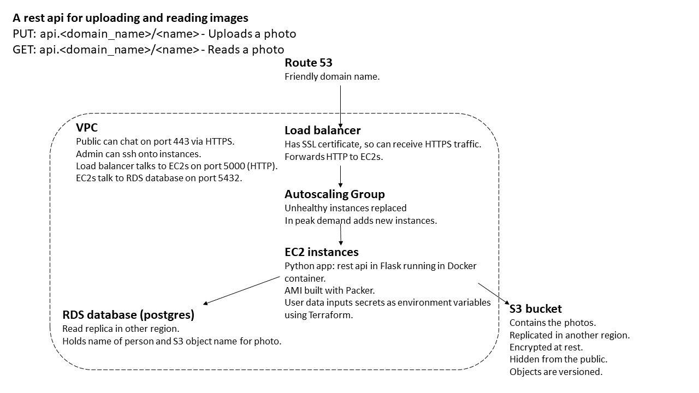

# Learning terraform

This project is mainly for the purpose of my own education in using Packer, Terraform, AWS services and Docker.

I built the following architecture





To run this codebase you need Packer, Terraform and AWS CLI installed along with your AWS credentials set-up.

You will need to have registered a domain name You need to associate a hosted zone and an SSL certificate for 
`api.<your_domain_name>` via route53.

The AMI image contains a Docker container and is built in `packer_file` (N.B. If you are running this not in eu-west-1, 
it is possible that the AMI chosen in `source "amazon-ebs" "my_image_app_ebs"` will not apply. Pick any AMI that runs
Amazon Linux 2). Inside that directory, run
```
packer build .\image_app_image.pkr.hcl
```
This produces an AMI image that will be save to your account. Make note of the image id.

You will need to write in the root directory of this project a `secret.tfvars` file that specifies the following
```
db_username           = XXX  // Details for the postgres database. Can be arbitary
db_password           = XXX
db_name               = XXX  
my_ip                 = XXX  // If you want to ssh into the instance
ssl_certificate_arn   = XXX  // The certificate for your domain name.
hosted_zone_id        = XXX  // Your hosted zone id for the domain name.
``` 
You can then also specify in a `terraform.tfvars` file
```
ami_name            = XXX  // AMI made by Packer above.
domain_name         = XXX  // Your registered domain name.
aws_region          = XXX  // Main region in which your app runs.
aws_back_up_region  = XXX  // Back-up region where data is replicated.
```


When all this is done, run from the root directory of this project
```
terraform init
```
and then

```
terraform apply --var-file="secret.tfvars"
```

After this it is running! It is at `api.<your_registered_domain_name>`. You can get and put images.

